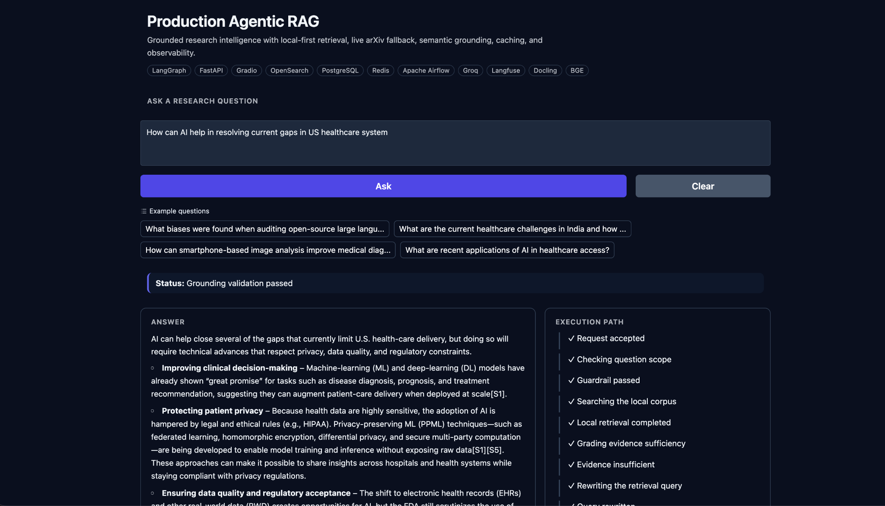
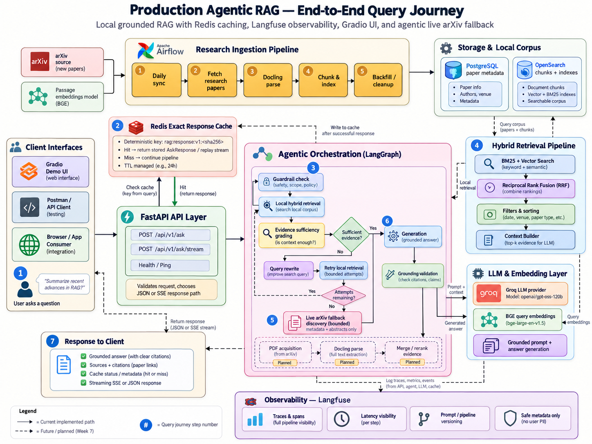
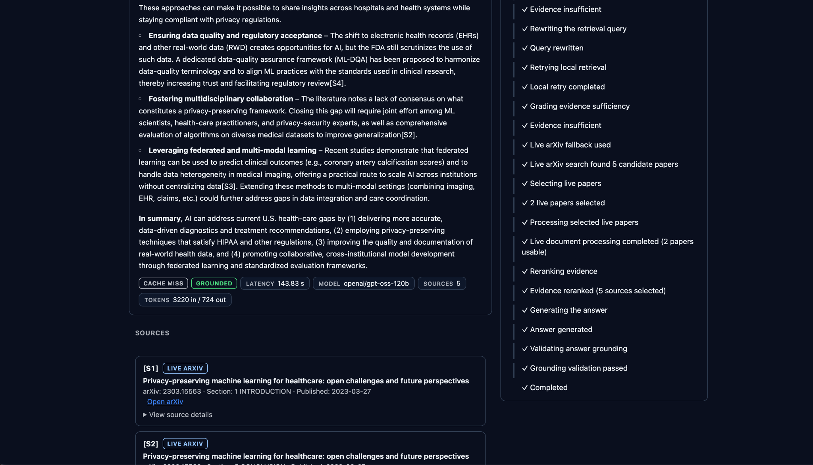
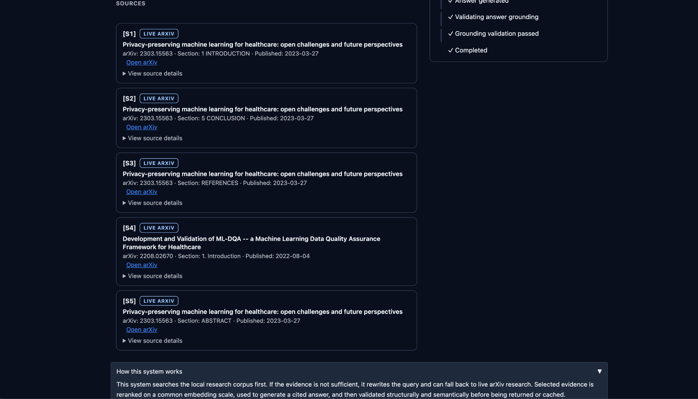
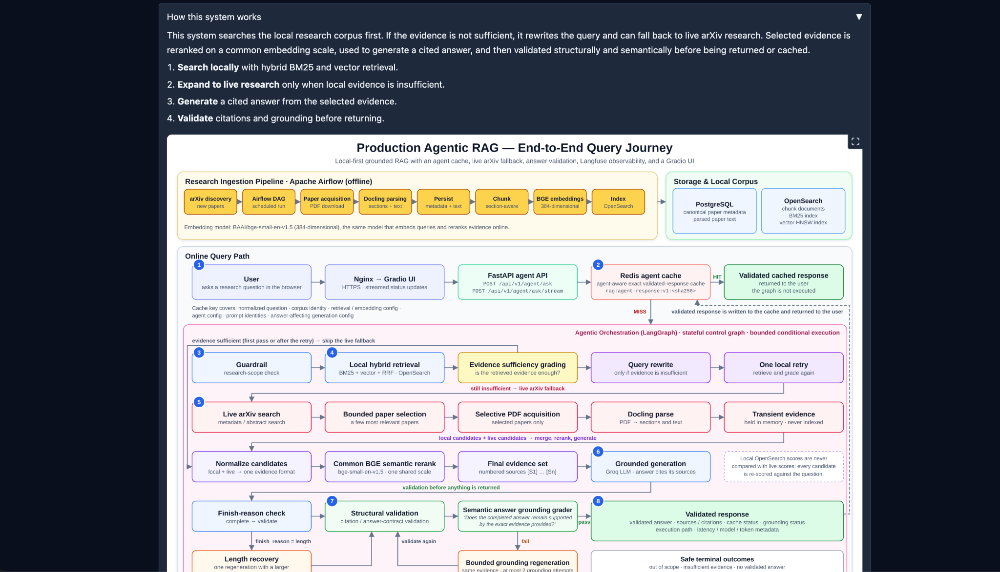

# Production Agentic RAG


A production-style research intelligence system that combines local-first hybrid
retrieval, evidence sufficiency grading, bounded live arXiv fallback, grounded
generation, semantic validation, caching, observability, and a recruiter-facing
Gradio interface.

## Live Demo

### [Open the live Production Agentic RAG demo](https://agenticrag.hbapps.dedyn.io)

<https://agenticrag.hbapps.dedyn.io> — ask a research question about AI, machine
learning, or healthcare AI, or click one of the example questions.

<p align="center">
  
</p>
<p align="center"><em>Recruiter-facing Gradio interface with example questions, grounded answers, execution metadata, and technology stack.</em></p>

## What This System Does

**Builds a local research corpus**

- Ingests research papers from arXiv on a schedule.
- Parses the PDFs with Docling.
- Stores canonical paper metadata and parsed text in PostgreSQL.
- Chunks papers by section and embeds the chunks with `BAAI/bge-small-en-v1.5`.
- Indexes the chunks in OpenSearch for keyword and vector search.

**Answers questions from evidence**

- Retrieves with BM25 and vector search, fused by Reciprocal Rank Fusion (RRF).
- Grades whether the retrieved evidence is sufficient to answer.
- Rewrites the query and retries local retrieval once when it is not.
- Falls back to live arXiv only when local evidence is still insufficient, and
  downloads and parses only the few papers it selects.
- Merges local and live candidates and reranks them on one common BGE relevance scale.
- Generates an answer that cites the selected evidence.

**Validates before it returns anything**

- Detects a truncated generation and recovers from it once.
- Validates citation structure, then semantic grounding against the evidence.
- Regenerates a bounded number of times when grounding fails.
- Caches only validated answers.
- Shows safe execution statuses in the UI and records traces in Langfuse.

## Key Capabilities

| Capability | What it means here |
|---|---|
| Local-first retrieval | The curated corpus is always searched before anything external |
| Agentic control | A LangGraph control graph decides whether to answer, rewrite, retry, or fall back |
| Bounded live fallback | At most 5 live arXiv candidates, at most 2 PDFs processed per request |
| Common reranking | Local and live evidence are rescored together with one embedding model |
| Two-stage validation | Structural citation checks, then a semantic grounding grader |
| Validated cache | Redis stores only complete, structurally valid, grounded answers |
| Safe transparency | The UI shows workflow statuses, never model reasoning or rejected text |
| Observability | Langfuse traces, generation observations, prompt versions, token usage |
| Deployed | HTTPS behind Nginx, Docker Compose under systemd, internal ports on loopback |

## Architecture

<p align="center">
  
</p>
<p align="center"><em>End-to-end architecture covering ingestion, hybrid retrieval, agentic control, live arXiv fallback, validation, caching, and observability.</em></p>

There are two halves. Offline, Airflow keeps a local corpus current in
PostgreSQL and OpenSearch. Online, a question enters through Gradio, reaches
the FastAPI agent endpoint, and is answered from the Redis cache or by a
LangGraph workflow. The workflow follows one rule set:

```text
local first
  -> assess the evidence
  -> expand only when necessary
  -> generate from the selected evidence
  -> validate before returning
  -> cache only validated output
```

## How It Works

### Research Ingestion

```text
arXiv -> Apache Airflow -> paper acquisition -> Docling PDF parsing -> PostgreSQL
      -> section-aware chunking -> BAAI/bge-small-en-v1.5 -> OpenSearch
```

An Airflow DAG runs daily (03:00 by default) over configurable arXiv topic
profiles. PostgreSQL holds the canonical paper metadata and parsed text.
OpenSearch holds the chunk documents with a BM25 index and a 384-dimensional
HNSW vector index. Chunks target 600 words with a 100-word overlap and keep
their section title.

### Hybrid Retrieval

```text
BM25 + semantic vector search -> Reciprocal Rank Fusion (RRF) -> top candidates
```

BM25 preserves keyword precision for names, acronyms, and identifiers.
Embeddings capture semantic similarity when the wording differs. RRF combines
the two by rank, so the incompatible raw scores are never compared directly.
The top candidates go to evidence sufficiency grading.

### Agentic Retrieval and Live Fallback

The agent is a LangGraph stateful control graph: specialized nodes and
services with bounded conditional execution.

```text
question -> guardrail -> local hybrid retrieval -> evidence sufficiency grading
  sufficient          -> rerank -> generate
  insufficient        -> query rewrite -> one local retry
  still insufficient  -> live arXiv fallback
```

The guardrail rejects questions outside the supported research scope. The
live fallback is the last resort, not a step every query takes:

```text
live arXiv metadata/abstract search -> bounded paper selection
  -> selective PDF acquisition -> Docling parse -> transient evidence
```

Only the selected papers are downloaded. Live evidence is held in memory for
that request and is not written to the corpus.

### Common Evidence Reranking

Local OpenSearch candidates and live candidates do not have comparable raw
scores, so they are never ranked against each other directly.

```text
local candidates + live candidates
  -> normalize to one evidence representation
  -> BGE semantic rerank against the original question
  -> final evidence set (up to 5 sources, labeled [S1]..[Sn])
```

Every candidate is rescored with the same embedding model, and only that
score orders the final evidence.

### Grounded Generation and Validation

```text
final evidence -> Groq LLM -> finish-reason check
  -> structural citation validation -> semantic answer grounding -> response
```

The deployment runs `openai/gpt-oss-120b` on Groq, set with `GROQ_MODEL`.

| Check | What it verifies |
|---|---|
| Structural validation | Citation labels exist, every label refers to a supplied source, and the answer contract is valid |
| Semantic grounding | A grader confirms the completed answer remains supported by the exact evidence supplied |

**Length recovery.** If the provider returns `finish_reason=length`, the
partial answer is not shown, not graded, and not cached. One regeneration is
attempted with a larger, capped token allowance, reusing the same question,
evidence, and source labels. Validation then runs only on the completed
result.

**Grounding regeneration.** If a complete, structurally valid answer fails
semantic grounding, it is regenerated from the same evidence and validated
again, for at most two grounding attempts in total.

Length recovery and grounding regeneration are separate mechanisms with
separate bounds. Nothing loops without a limit; when the bounds are exhausted
the user gets a fixed safe message instead of an unvalidated answer.

### Validated Response Caching

Redis is an exact-match cache keyed as `rag:agent-response:v1:<sha256>`. The
hash covers the state that can change an answer: the normalized question,
corpus identity, retrieval settings, embedding identity, agent settings,
prompt identities, and generation and recovery settings. Changing any of
them produces a new key instead of a stale answer.

| Event | Behavior |
|---|---|
| HIT | The validated cached response is returned directly; the graph does not run |
| MISS | The graph executes |
| WRITE | Only after a complete, structurally valid, semantically grounded answer |

Truncated, failed, and ungrounded answers are never cached. The default TTL
is 24 hours (`RAG_CACHE_TTL_SECONDS=86400`). A Redis outage never fails a
request.

## Recruiter-Facing Gradio UI

<p align="center">
  
</p>
<p align="center"><em>Validated answer with cache state, grounding status, latency, token usage, and safe execution-path events.</em></p>

- Public HTTPS interface with four clickable example questions.
- The answer rendered as Markdown with its `[S1]` citations.
- A summary row: `CACHE HIT` / `MISS` / `BYPASS`, grounding status, latency,
  model, source count, and token usage.
- An execution timeline of the statuses the backend streamed, in order.
- `Clear` resets the question and every response panel.
- Responsive layout that works in light and dark themes.

The execution path shows safe workflow statuses such as "Evidence
insufficient" or "Query rewritten". It is not model chain-of-thought, and
the UI never renders rejected or partial model output.

### Evidence and Sources

<p align="center">
  
</p>
<p align="center"><em>Structured evidence cards with citation IDs, source type, paper metadata, and arXiv links.</em></p>

Each source card shows the citation label, a `LOCAL` or `LIVE ARXIV` badge,
the title, arXiv ID, section, publication date, a link where one is
available, and an expandable excerpt of the evidence. Sources are chunks, so
several chunks from one paper appear as separate cards.

### In-App Architecture Walkthrough

<p align="center">
  
</p>
<p align="center"><em>The public UI includes a collapsible architecture walkthrough so users can see how retrieval, live fallback, generation, and validation fit together.</em></p>

A collapsed "How this system works" section holds a four-step explanation and
the architecture diagram, with a fullscreen view. It lets a technical
reviewer understand the system without crowding the query interface.

## Technology Stack

| Area | Technology |
|---|---|
| Application | Python 3.12, FastAPI, Gradio 6, LangGraph |
| Retrieval | OpenSearch 2.19 (BM25, HNSW vectors), RRF, `BAAI/bge-small-en-v1.5` (384-d) |
| Data | PostgreSQL 16, Redis 7 |
| Ingestion | Apache Airflow 2.10, arXiv API, Docling |
| LLM | Groq, `openai/gpt-oss-120b` |
| Observability | Langfuse |
| Infrastructure | Docker Compose, Nginx, Let's Encrypt / Certbot, systemd, deSEC DNS |
| Development | uv, pytest, Ruff |

## Docker Services

One Compose project (`compose.yml`) runs seven persistent services, all with
`restart: unless-stopped`.

| Service | Role | Host binding | Container port | Public? | Health check |
|---|---|---|---|---|---|
| `api` | FastAPI agent API | `127.0.0.1:8000` | 8000 | No | `GET /api/v1/health` |
| `gradio` | Demo UI (same image as `api`) | `127.0.0.1:7860` | 7860 | Via Nginx only | HTTP `GET /` |
| `airflow` | Ingestion scheduler and webserver | `127.0.0.1:8080` | 8080 | No | `/health`: metadata DB and scheduler |
| `postgres` | Paper metadata, parsed text, Airflow metadata | `127.0.0.1:5432` | 5432 | No | `pg_isready` |
| `redis` | Validated response cache | `127.0.0.1:6379` | 6379 | No | `redis-cli ping` |
| `opensearch` | Chunk index: BM25 and vectors | `127.0.0.1:9200`, `127.0.0.1:9600` | 9200, 9600 | No | `/_cluster/health` |
| `opensearch-dashboards` | Index inspection | `127.0.0.1:5601` | 5601 | No | `/api/status` |

Every application and infrastructure port is bound to the host loopback.

## Network / Port Architecture

| Scope | Ports |
|---|---|
| Public | 22 (SSH), 80 (redirect to HTTPS, ACME), 443 (HTTPS) |
| Loopback only | 7860, 8000, 8080, 5601, 9200, 9600, 5432, 6379 |

Nginx is the only application-level public ingress, and it proxies only to
Gradio. Gradio calls the API over the Compose network at `http://api:8000`;
it never uses the public hostname for backend calls. To reach a private tool
on a server, use an SSH tunnel, for example
`ssh -L 8080:127.0.0.1:8080 <host>` for Airflow.

## Quick Start

Requirements: Docker with Compose, [uv](https://docs.astral.sh/uv/), and a
Groq API key for generation.

```bash
git clone https://github.com/hbhangale3/production-agentic-rag-lab.git
cd production-agentic-rag-lab

cp .env.example .env        # then set GROQ_API_KEY
uv sync

docker compose up -d --build
docker compose ps

curl http://127.0.0.1:8000/api/v1/ping
curl http://127.0.0.1:8000/api/v1/health
```

Then open <http://127.0.0.1:7860>. The first build is slow because the image
includes the embedding and PDF-parsing dependencies. Answering a question
requires valid Groq credentials, and the corpus is empty until the Airflow
ingestion DAG (`airflow/dags/arxiv_paper_ingestion.py`) has run.

## Configuration

`.env.example` is the authoritative reference for every setting. Keep real
keys in `.env`, which is not committed.

| Group | Settings |
|---|---|
| LLM | `GROQ_API_KEY`, `GROQ_MODEL`, `LLM_MAX_COMPLETION_TOKENS`, `LLM_LENGTH_RECOVERY_MAX_TOKENS`, `LLM_TEMPERATURE` |
| Retrieval | `OPENSEARCH_HOST`, `OPENSEARCH_CHUNK_INDEX_NAME`, `EMBEDDING_MODEL`, `EMBEDDING_DIMENSION`, `RAG_RETRIEVAL_SIZE`, `CHUNK_TARGET_WORDS` |
| Agent | `AGENT_REQUEST_TIMEOUT_SECONDS`, `AGENT_LIVE_PAPER_TIMEOUT_SECONDS`, `AGENT_LIVE_ARXIV_TIMEOUT_SECONDS`, `AGENT_LIVE_ARXIV_MAX_RETRIES` |
| Redis | `REDIS_ENABLED`, `REDIS_URL`, `RAG_CACHE_TTL_SECONDS`, `RAG_CORPUS_GENERATION` |
| Langfuse | `LANGFUSE_ENABLED`, `LANGFUSE_HOST`, `LANGFUSE_PUBLIC_KEY`, `LANGFUSE_SECRET_KEY`, `LANGFUSE_PROMPT_MANAGEMENT_ENABLED`, `LANGFUSE_CAPTURE_CONTENT` |
| Ingestion | `ARXIV_INGESTION_PROFILES`, `ARXIV_INGESTION_SCHEDULE`, `ARXIV_INGESTION_BATCH_SIZE` |

The model in `.env.example` is `llama-3.3-70b-versatile`; the deployment sets
`GROQ_MODEL=openai/gpt-oss-120b`. Redis and Langfuse are off until enabled.
The agent's decision bounds (evidence and grounding thresholds, one local
retry, two grounding attempts, live paper limits) are code-level defaults in
`src/services/agent/config.py`. Bump `RAG_CORPUS_GENERATION` after a corpus
change that should invalidate cached answers.

## API

All routes are under `/api/v1`. The API is not exposed publicly; these
examples run on the host.

### Agent Endpoints

| Endpoint | Purpose |
|---|---|
| `POST /api/v1/agent/ask` | One JSON response: answer, sources, cache status, outcome, execution statuses |
| `POST /api/v1/agent/ask/stream` | Server-sent events: statuses as they happen, then the validated answer |

```bash
curl -s http://127.0.0.1:8000/api/v1/agent/ask \
  -H 'Content-Type: application/json' \
  -d '{"question": "How can AI improve healthcare access for underserved populations?"}'
```

`outcome` is one of `answered`, `out_of_scope`, `insufficient_evidence`,
`grounding_failed`, or `generation_failed`. A model-written answer is
returned only for `answered`; the others carry a fixed safe message.

### Streaming Events

| Event | Content |
|---|---|
| `metadata` | Cache status and pipeline version |
| `status` | One safe execution status (code and message) |
| `answer` | The full validated answer text |
| `sources` | The sources the answer cites |
| `outcome` | A non-answer outcome with its safe message |
| `done` | Final outcome, grounding result, model, token counts |
| `error` | A safe error code and message |

The answer is emitted once, only after validation succeeds. The stream does
not carry raw model tokens, so nothing unvalidated reaches the client.

### Health Endpoints

| Endpoint | Purpose |
|---|---|
| `GET /api/v1/ping` | Liveness |
| `GET /api/v1/health` | Database status and cache status with hit/miss counters |

Lower-level routes remain available for inspection and are not the primary
path: `POST /api/v1/hybrid-search`, `GET /api/v1/search/*` (BM25 variants),
`GET /api/v1/papers/{arxiv_id}`, and the single-pass RAG routes
`POST /api/v1/ask` and `/api/v1/ask/stream`.

## Observability

Langfuse support is optional and off by default.

- A trace per request with spans for the graph's nodes.
- A Generation observation for every model call, with model, provider,
  latency, and token usage.
- Prompt identity and version linked to the generations that used them, with
  optional Langfuse-managed prompts and local prompts as the fallback.
- Cost, when token prices are configured.
- Safe metadata only: content capture is disabled unless
  `LANGFUSE_CAPTURE_CONTENT=true`.

Tracing fails open. A Langfuse outage or misconfiguration never changes an
answer and never fails a request.

## Observed Production Telemetry

Langfuse telemetry from acceptance and production testing shows a clear split
between cache-hit traffic and full agentic execution.

| Metric | Observed value |
|---|---:|
| Total traces | 135 |
| Agent traces | 40 |
| RAG traces | 95 |
| GPT-OSS-120B tokens observed | 155.63K |
| Agent request p50 | 0.01 s |
| Agent request p90 | 1m 44s |
| Agent request p95 | 2m 58s |
| Agent request p99 | 3m 14s |

Selected generation observations:

| Stage | p50 | p95 |
|---|---:|---:|
| Guardrail | 0.50 s | 1.54 s |
| Query rewrite | 0.70 s | 2.92 s |
| Evidence grader | 4.96 s | 37.83 s |
| Live paper selector | 12.18 s | 13.23 s |
| Answer grounding | 39.02 s | 42.70 s |

These measurements are observed from the deployed system and are not guaranteed
benchmarks. The very low overall p50 is influenced by Redis cache hits, while
the multi-minute tail reflects agentic requests that may perform rewrite,
live arXiv search, PDF acquisition, Docling parsing, reranking, generation,
and semantic grounding.

## Production Deployment

Public URL: <https://agenticrag.hbapps.dedyn.io>

```text
Internet -> deSEC DNS -> Nginx (80/443) -> Gradio (127.0.0.1:7860)
         -> FastAPI (Compose network) -> PostgreSQL, OpenSearch, Redis
```

### Nginx + HTTPS

Host-level Nginx terminates TLS with a Let's Encrypt certificate and proxies
only to Gradio. HTTP redirects permanently to HTTPS. `certbot.timer` renews
the certificate and a deploy hook reloads Nginx. Response buffering is off so
status events arrive as they happen, and proxy timeouts are 600 seconds so a
long agent run is ended by the application, not the proxy. The configuration
and installer are in `deploy/nginx/`.

### systemd

| Unit | Owns |
|---|---|
| `docker.service` | The Docker daemon |
| `production-agentic-rag.service` | The Compose stack: starts it at boot and waits for every service to be healthy |
| `nginx.service` | The reverse proxy, independently of the stack, with `Restart=on-failure` |

```bash
sudo systemctl start production-agentic-rag.service
sudo systemctl stop production-agentic-rag.service
sudo systemctl restart production-agentic-rag.service
sudo systemctl status production-agentic-rag.service
sudo systemctl status nginx
```

### Docker Compose

Compose owns dependency order, health checks, restart policies, networking,
and volumes. Gradio and the API share one image, so a code change is one
rebuild: `docker compose build gradio && docker compose up -d --wait`.

Deployment details are in
[docs/week7-m11-compose-stack-autostart.md](docs/week7-m11-compose-stack-autostart.md)
and
[docs/week7-m12-nginx-https-reverse-proxy.md](docs/week7-m12-nginx-https-reverse-proxy.md).

## Project Structure

```text
production-agentic-rag-lab/
├── airflow/            # Airflow image, entrypoint, ingestion DAGs
├── deploy/
│   ├── nginx/          # reverse-proxy config and installer
│   └── systemd/        # Compose stack unit
├── docs/               # design notes and acceptance records
├── scripts/            # manual search API checks
├── src/
│   ├── assets/         # architecture diagram shown in the UI
│   ├── routers/        # FastAPI routes
│   ├── schemas/        # request and response models
│   ├── services/       # agent, retrieval, embeddings, LLM, cache, observability
│   ├── gradio_app.py   # demo UI
│   ├── gradio_client.py
│   └── main.py         # FastAPI application
├── static/             # README images
├── tests/              # unit, API, and integration tests
├── compose.yml
├── Dockerfile
├── pyproject.toml
└── README.md
```

## Testing

```bash
env -u DEBUG \
  REDIS_ENABLED=false \
  LANGFUSE_ENABLED=false \
  uv run pytest -q
```

Current baseline: 2101 passed, 10 warnings. The suite runs without Redis or
Langfuse.

```bash
uv run ruff check .
git diff --check
uv lock --check
```

## Operations

```bash
docker compose up -d                 # start
docker compose up -d --build         # rebuild and start
docker compose ps
docker compose logs -f api
docker compose logs -f gradio
docker compose logs -f airflow
docker compose stop                  # stop, keeping containers and data

curl http://127.0.0.1:8000/api/v1/ping
curl http://127.0.0.1:8000/api/v1/health

systemctl status production-agentic-rag.service
systemctl status nginx
systemctl status certbot.timer
sudo nginx -t
```

Do not use `docker compose down -v` as a routine command: it deletes the
PostgreSQL, OpenSearch, Redis, and Airflow volumes.

## Key Design Decisions

### Local-first retrieval

Curated local evidence is preferred. External search costs time and is used
only when the local corpus cannot support an answer.

### Hybrid search

BM25 and vectors together, fused by rank, instead of vector-only retrieval.

### Common reranking

Local and live evidence are rescored on one BGE scale instead of trusting
scores from different systems.

### Validation before caching

Only validated answers enter Redis, so a cache hit is as trustworthy as a
fresh answer.

### Bounded control flow

One local retry, one length recovery, two grounding attempts, capped live
papers, and a request timeout. There are no uncontrolled retries.

### Safe transparency

The UI and API expose workflow statuses, not chain-of-thought.

## Production Safety Properties

- Internal services are bound to loopback; Nginx is the only public ingress.
- Public traffic is HTTPS, with HTTP redirected.
- Incomplete generations are never exposed and never cached.
- Ungrounded outputs are never cached.
- Structural citation validation and semantic grounding run on every answer.
- Every retry and fallback is bounded.
- The cache identity includes prompts and answer-affecting configuration.
- Langfuse content capture is off by default.
- Execution statuses are fixed, safe strings.

These reduce risk; they are not a claim of complete security. See the
limitations below.

## Example Execution Paths / Performance

```text
A. Cache hit
   question -> Redis HIT -> validated response

B. Local evidence sufficient
   question -> guardrail -> local hybrid retrieval -> evidence sufficient
            -> rerank -> generate -> validate -> cache

C. Adaptive live fallback
   question -> local retrieval -> insufficient -> rewrite -> local retry
            -> insufficient -> live arXiv -> PDF + Docling
            -> common BGE rerank -> generate -> validate -> cache
```

Observed in acceptance testing on a 6-core, CPU-only VPS. These are single
measurements, not guarantees.

| Path | Observed |
|---|---|
| Cache hit | Single-digit milliseconds server-side |
| Local generation | About 79 s in one run |
| Live fallback with PDF and Docling | About 198 s in one run |

## Known Limitations

- Groq quota and rate limits apply to every uncached question.
- The public UI has no authentication or rate limiting.
- The cache is exact-match, not semantic: a reworded question is a miss.
- Several chunks from one paper appear as separate source cards.
- Single-node OpenSearch reports yellow because replicas cannot be placed.
- Live Docling processing is CPU- and memory-intensive, and a live fallback
  can take minutes.
- The Airflow container runs the webserver and scheduler together.
- There is no conversation memory; each question is independent.
- The current VPS has no swap.
- Development credentials for PostgreSQL and Airflow are defaults in the
  Compose setup; they are reachable only from the host.

## Troubleshooting

| Symptom | Check |
|---|---|
| A service is unhealthy | `docker compose ps -a`, then `docker compose logs --tail=200 <service>` |
| The stack did not start at boot | `systemctl status production-agentic-rag.service` |
| 502 from the public URL | Gradio is down or still starting: `curl -I http://127.0.0.1:7860/` |
| Nginx will not reload | `sudo nginx -t`, then `systemctl status nginx` |
| Certificate problems | `systemctl status certbot.timer`, then `sudo certbot renew --dry-run` |
| No `LOCAL` sources ever appear | The corpus is empty; run the Airflow ingestion DAG |
| Answers fail after retrieval | Check `GROQ_API_KEY` and Groq quota in `docker compose logs api` |

## License

MIT. See [LICENSE](LICENSE).
