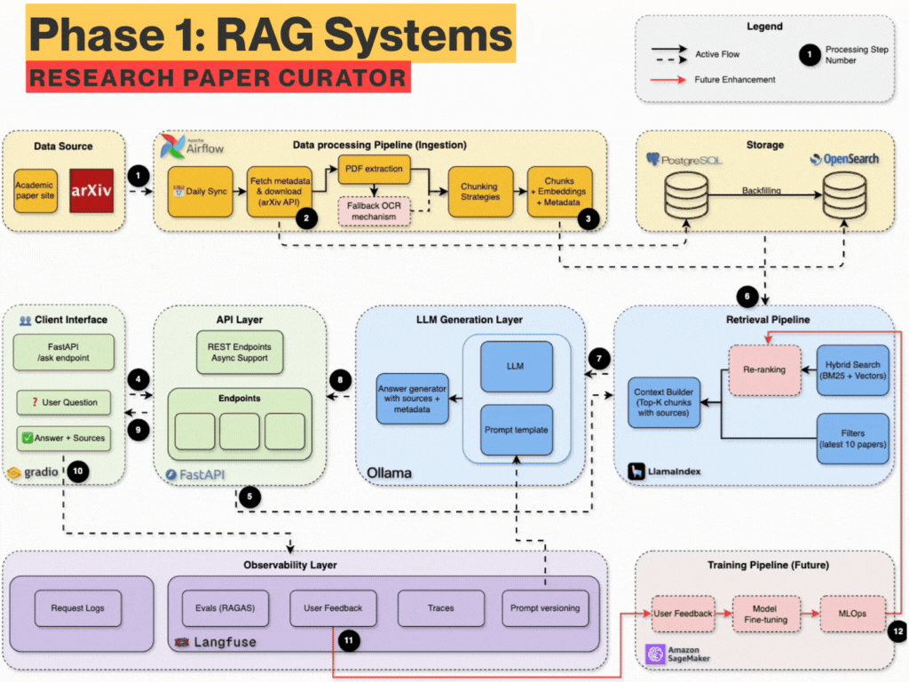
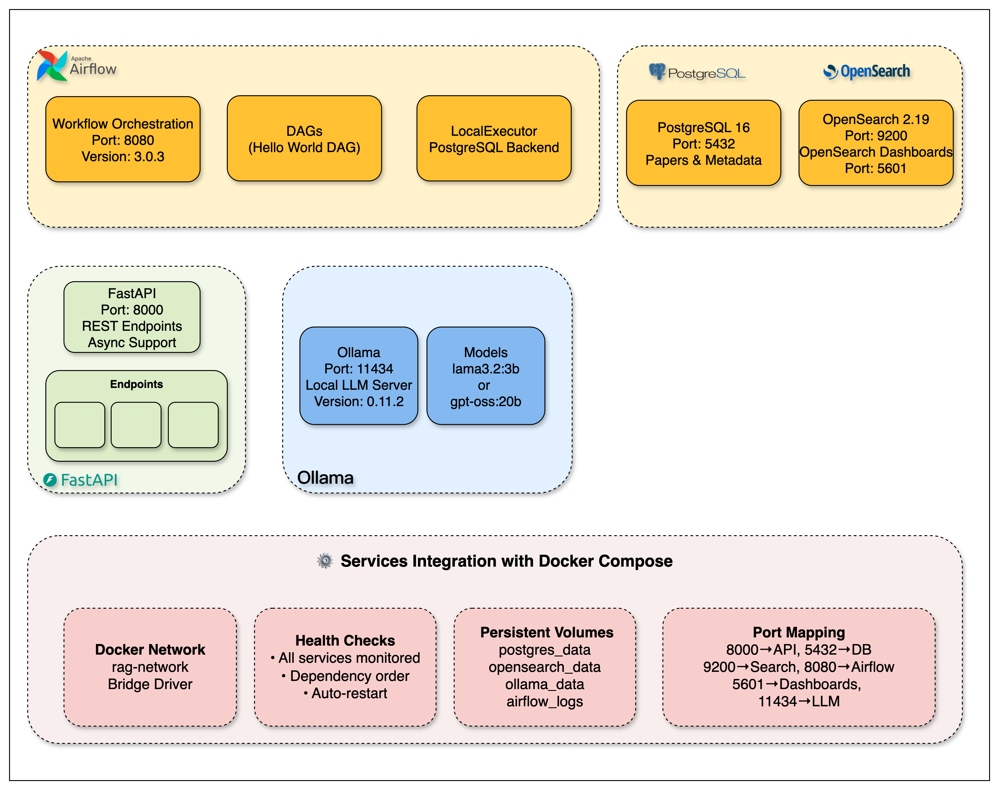

# The Mother of AI Project
## Phase 1 RAG Systems: arXiv Paper Curator

<div align="center">
  <h3>A Learner-Focused Journey into Production RAG Systems</h3>
  <p>Learn to build modern AI systems from the ground up through hands-on implementation</p>
  <p>Master the most in-demand AI engineering skills: <strong>RAG (Retrieval-Augmented Generation)</strong></p>
</div>

<p align="center">
  
  
  
  
  
</p>

</br>

<p align="center">
  <a href="#-about-this-course">
    
  </a>
</p>

## 📖 About This Course

This is a **learner-focused project** where you'll build a complete research assistant system that automatically fetches academic papers, understands their content, and answers your research questions using advanced RAG techniques.

**The arXiv Paper Curator** will teach you to build a **production-grade RAG system using industry best practices**. You'll master the architecture, implementation, and deployment of AI systems that professionals use in the real world.

By the end of this course, you'll have your own AI research assistant and the skills to build similar systems for any domain.

---

## 🤖 Week 7: Agentic RAG

A bounded LangGraph agent answers research questions about AI, machine
learning, NLP, and healthcare AI. It retrieves from the local corpus, checks
whether that evidence is sufficient, falls back to live arXiv when it is not,
and only returns an answer that has passed semantic grounding against the
exact sources it was written from.

```text
User -> Gradio -> FastAPI
  -> resolve prompt bundle -> agent cache lookup (Redis)
       HIT  -> validated cached answer, graph not run
       MISS -> LangGraph
                 guardrail (in scope?)
                 local hybrid retrieval (BM25 + BGE vectors, RRF)
                 evidence-sufficiency grader
                   insufficient -> rewrite query once -> local retry -> grade again
                   still insufficient -> live arXiv search
                                         -> select up to 2 papers -> PDF -> Docling -> chunks
                 normalize local + live evidence -> common BGE rerank -> top sources
                 grounded generation -> structural citation validation
                 semantic answer grounding -> regenerate once if it fails
               -> cache only a grounded, cited answer -> response
```

Langfuse (optional, metadata-only by default) records every model call as a
generation with model, token usage, latency, and prompt identity. Redis and
Langfuse outages never make the agent unavailable.

**Key technologies:** FastAPI, LangGraph, Groq (via a provider-neutral LLM
interface), OpenSearch, sentence-transformers BGE embeddings, Docling, Redis,
Langfuse, PostgreSQL, Airflow, Gradio.

### Agent endpoints

| Endpoint | Purpose |
|---|---|
| `POST /api/v1/agent/ask` | One JSON response: answer, sources, cache status, outcome |
| `POST /api/v1/agent/ask/stream` | Server-sent events: safe execution statuses, then the validated answer |
| `POST /api/v1/ask`, `POST /api/v1/ask/stream` | The Week 5/6 single-pass RAG endpoints, unchanged |

```bash
curl -s http://127.0.0.1:8000/api/v1/agent/ask \
  -H 'Content-Type: application/json' \
  -d '{"question": "How can AI improve healthcare access for underserved populations?"}'
```

The response reports `outcome` as `answered`, `out_of_scope`,
`insufficient_evidence`, `grounding_failed`, or `generation_failed`. A model-written answer is
returned only for `answered`; the stream never emits an answer before it has
passed grounding, and it never exposes model reasoning.

### Run it locally

```bash
docker compose up -d                       # API on 127.0.0.1:8000, plus OpenSearch, Postgres, Redis
curl http://127.0.0.1:8000/api/v1/health
RAG_API_BASE_URL=http://127.0.0.1:8000 uv run python -m src.gradio_app   # UI on 127.0.0.1:7860
```

The Gradio demo shows the answer, its sources (labeled `LOCAL` or
`LIVE ARXIV`), the execution path, cache HIT/MISS, and response time.

Design notes for each milestone are in `docs/week7-m01-*.md` through
`docs/week7-m10-agent-api-gradio-acceptance.md`.

---

## 🚀 Quick Start

### Week 6 RAG demo

The FastAPI RAG endpoints support optional exact-response Redis caching shared
between `/api/v1/ask` and `/api/v1/ask/stream`. The Gradio client displays the
authoritative per-request cache outcome, total response time, and safe pipeline
metadata. Cache health and process-local counters are available from
`/api/v1/health`.

Langfuse observability is optional and metadata-only by default. Redis or
Langfuse outages do not make the core RAG path unavailable. Configure the
optional services through the documented `REDIS_*`, `RAG_CACHE_*`, and
`LANGFUSE_*` values in `.env.example`; credentials are not required when they
are disabled.

Run the API and demo locally with:

```bash
uv run uvicorn src.main:app --host 127.0.0.1 --port 8001
RAG_API_BASE_URL=http://127.0.0.1:8001 uv run python -m src.gradio_app
```

The Gradio demo now calls the Week 7 agent endpoint and defaults to the Docker
API at `http://127.0.0.1:8000`; set `RAG_API_BASE_URL` to point it elsewhere.

### **📋 Prerequisites**
- **Docker Desktop** (with Docker Compose)  
- **Python 3.12+**
- **UV Package Manager** ([Install Guide](https://docs.astral.sh/uv/getting-started/installation/))
- **8GB+ RAM** and **20GB+ free disk space**

### **⚡ Get Started**

```bash
# 1. Clone and setup
git clone <repository-url>
cd zero_to_RAG
uv sync

# 2. Start all services
docker compose up --build -d

# 3. Verify everything works
curl http://localhost:8000/health
```

### **📊 Access Your Services**

| Service | URL | Purpose |
|---------|-----|---------|
| **API Documentation** | http://localhost:8000/docs | Interactive API testing |
| **Airflow Dashboard** | http://localhost:8080 | Workflow management |
| **OpenSearch Dashboards** | http://localhost:5601 | Hybrid search engine UI |

#### **NOTE**: Default Airflow credentials are **username**: `admin`, **password**: `admin`
---

## 📚 Learning Materials

### **📓 Week 1: Complete Setup Guide**
**Start here!** Follow our comprehensive setup notebook:
Please run it in terminal

```bash
# Launch the Week 1 notebook
uv run jupyter notebook notebooks/week1/week1_setup.ipynb
```

**What you'll learn in Week 1:**
- Complete infrastructure setup with Docker Compose
- FastAPI development with automatic documentation and health checks
- PostgreSQL database configuration and management
- OpenSearch hybrid search engine setup
- Ollama local LLM service configuration
- Service orchestration and health monitoring
- Professional development environment with code quality tools

### **🏗️ Week 1 Infrastructure Architecture**

<p align="center">
  
</p>

**Week 1 Infrastructure Components:**
- **FastAPI**: REST endpoints with async support (Port 8000)  
- **PostgreSQL 16**: Paper metadata storage (Port 5432)
- **OpenSearch 2.19**: Search engine with dashboards (Ports 9200, 5601)
- **Apache Airflow 2.10**: Workflow orchestration (Port 8080)
- **Ollama 0.11**: Local LLM server (Port 11434)

### **📖 Week 1 Blog Post**
[The Infrastructure That Powers RAG Systems](https://jamwithai.substack.com/p/the-infrastructure-that-powers-rag) - Detailed walkthrough and production insights.

---

## 🛠️ Technology Stack

| Service | Purpose | Status |
|---------|---------|--------|
| **FastAPI** | REST API with automatic docs | ✅ Ready |
| **PostgreSQL 16** | Paper metadata and content storage | ✅ Ready |
| **OpenSearch 2.19** | Hybrid search engine | ✅ Ready |
| **Apache Airflow 2.10** | Workflow automation | ✅ Ready |
| **Ollama 0.11** | Local LLM serving | ✅ Ready |

**Development Tools:** UV, Ruff, MyPy, Pytest, Docker Compose

---

## 🎯 What You're Building

### **Week 1: Infrastructure Foundation** ✅
- Multi-service architecture using Docker Compose
- REST API with health monitoring and documentation
- Database setup with proper schema design
- Search engine configuration for future RAG features
- Professional development environment

### **Future Weeks: Complete RAG System** (6-Week Course)
- **Week 2:** arXiv API integration, PDF parsing with Docling, automated data ingestion
- **Week 3:** OpenSearch hybrid search implementation with BM25 + semantic vectors
- **Week 4:** Context-aware chunking and retrieval evaluation with nDCG metrics
- **Week 5:** Full RAG pipeline with LLM integration and prompt optimization
- **Week 6:** Observability with Langfuse, A/B testing, and production deployment

---

## 🏗️ Project Structure (Week 1)

```
zero_to_RAG/
├── src/                       # Main application code
│   ├── main.py                # FastAPI application
│   ├── routers/               # API endpoints
│   ├── models/                # Database models (SQLAlchemy)
│   ├── repositories/          # Data access layer
│   ├── schemas/               # Pydantic validation schemas
│   ├── services/              # Business logic
│   ├── db/                    # Database configuration
│   ├── config.py              # Environment configuration
│   └── dependencies.py        # Dependency injection
│
├── notebooks/week1/           # Learning materials
│   └── week1_setup.ipynb      # Complete setup guide
│
├── tests/                     # Comprehensive test suite
├── airflow/dags/              # Workflow definitions
├── static/                    # Assets (images, GIFs)
└── compose.yml                # Service orchestration
```

---

## 🔧 Essential Commands

### **Using the Makefile** (Recommended)
```bash
# View all available commands
make help

# Quick workflow
make start         # Start all services
make health        # Check all services health
make test          # Run tests
make stop          # Stop services
```

### **All Available Commands**
| Command | Description |
|---------|-------------|
| `make start` | Start all services |
| `make stop` | Stop all services |
| `make restart` | Restart all services |
| `make status` | Show service status |
| `make logs` | Show service logs |
| `make health` | Check all services health |
| `make setup` | Install Python dependencies |
| `make format` | Format code |
| `make lint` | Lint and type check |
| `make test` | Run tests |
| `make test-cov` | Run tests with coverage |
| `make clean` | Clean up everything |

### **Direct Commands** (Alternative)
```bash
# If you prefer using commands directly
docker compose up --build -d    # Start services
docker compose ps               # Check status
docker compose logs            # View logs
uv run pytest                 # Run tests
```

### Manual BM25 API Demo

With FastAPI and OpenSearch running, execute:

```bash
uv run python scripts/test_bm25_search_apis.py
```

The script calls all seven Week 3 search endpoints over HTTP using real indexed papers and prints up to five ranked results per strategy. Set `API_BASE_URL` or `RESULT_SIZE` to override the defaults. It is a manual learning, demonstration, and integration-validation tool; it is intentionally outside the normal pytest suite.

### Week 5 Grounded RAG Demo

Week 5 provides grounded JSON and SSE APIs plus a local Gradio presentation layer.
Start FastAPI and Gradio in separate terminals:

```bash
OPENSEARCH_HOST=http://127.0.0.1:9200 \
  uv run uvicorn src.main:app --host 127.0.0.1 --port 8001

RAG_API_BASE_URL=http://127.0.0.1:8001 \
  uv run python -m src.gradio_app
```

Open <http://127.0.0.1:7860>. The UI consumes the real streaming endpoint; it
does not call Groq or retrieval services directly. See
[the final Week 5 guide](docs/week5-m08-final.md) for architecture, API contracts,
limitations, and safe SSH-tunnel instructions.

---

## 🎓 Learning Path

### **Week 1 Success Criteria**
Complete when you can:
- [ ] Start all services with `docker compose up -d`
- [ ] Access API docs at http://localhost:8000/docs  
- [ ] Login to Airflow at http://localhost:8080
- [ ] Browse OpenSearch at http://localhost:5601
- [ ] All tests pass: `uv run pytest`

### **Target Audience**
| Who | Why |
|-----|-----|
| **AI/ML Engineers** | Learn production RAG architecture beyond tutorials |
| **Software Engineers** | Build end-to-end AI applications with best practices |
| **Data Scientists** | Implement production AI systems using modern tools |

---

## 🛠️ Troubleshooting

**Common Issues:**
- **Services not starting?** Wait 2-3 minutes, check `docker compose logs`
- **Port conflicts?** Stop other services using ports 8000, 8080, 5432, 9200
- **Memory issues?** Increase Docker Desktop memory allocation

**Get Help:**
- Check the comprehensive Week 1 notebook troubleshooting section
- Review service logs: `docker compose logs [service-name]`
- Complete reset: `docker compose down --volumes && docker compose up --build -d`

---

## 💰 Cost Structure

**This course is completely free!** You'll only need minimal costs for optional services:
- **Local Development:** $0 (everything runs locally)
- **Optional Cloud APIs:** ~$2-5 for external LLM services (if chosen)

---

<div align="center">
  <h3>🎉 Ready to Start Your AI Engineering Journey?</h3>
  <p><strong>Begin with the Week 1 setup notebook and build your first production RAG system!</strong></p>
  
  <p><em>For learners who want to master modern AI engineering</em></p>
  <p><strong>Built with love by Jam With AI</strong></p>
</div>

---

## 📄 License

MIT License - see [LICENSE](LICENSE) file for details.
